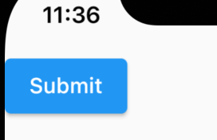

Title: Flutter の ElevatedButton

Priority: 10

ElevatedButton は高さが設定されているボタンです。大事なアクションを決定させるときなどに使用しましょう。



```
ElevatedButton(
  child: const Text("Submit"),
  onPressed: () {
    print("OK");
  },
)
```
