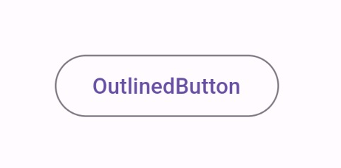

Title: Flutter の OutlinedButton

[公式ドキュメント：OutlinedButton class](https://api.flutter.dev/flutter/material/OutlinedButton-class.html)

OutlinedButton class は、基本的には、 枠線が描かれた TextButton です。重要だけどアプリのメインではないアクションなど、中程度の強調のボタンに使います。



```
OutlinedButton(
      child: const Text("OutlinedButton"),
      onPressed: () {
        // ボタンが押されたときの処理
      },
    )
```
