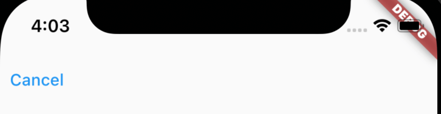

Title: FlutterのTextButton

Priority: 20

TextButtonButtonは文字のみのボタンです。キャンセルや「パスワードを忘れた方」といった、大事ではないアクションを決定させるときなどに使用しましょう。



```
TextButton(       
  child: const Text("Cancel"),
  onPressed: () {
    print("OK");
  },
)
```
