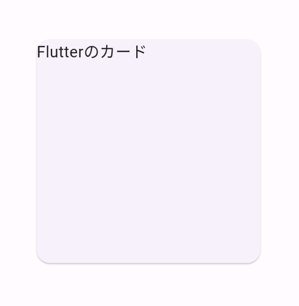
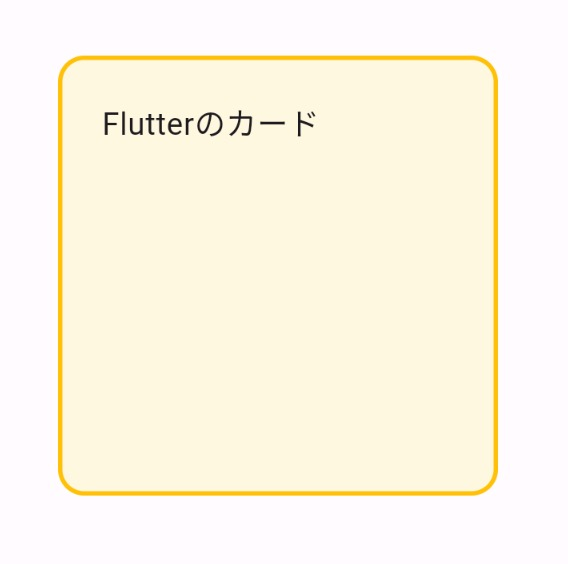

Title: Flutter の Card class

[公式ドキュメント：Card class](https://api.flutter.dev/flutter/material/Card-class.html)

Flutter の Card class は、カードのようなレイアウトを作成するためのウィジェットです。

child プロパティに子ウィジェットを配置することができます。


```
Card(
    child: const Text('Flutterのカード'),
)
```

カードのサイズは基本的に子要素の大きさに依存します。
子要素に SizedBox を設定することで、カードのサイズを簡単に指定することができます。



```
Card(
    child: const SizedBox(
    width: 200,
    height: 200,
    child: Text('Flutterのカード'),
    ),
)
```

その他、枠線、背景色、影などのスタイルを適用して、カードの外観をカスタマイズすることができます。



```
Card(
    color: Colors.amber[50],
    elevation: 0,
    shape: const RoundedRectangleBorder(
    side: BorderSide(color: Colors.amber, width: 2),
    borderRadius: BorderRadius.all(Radius.circular(12)),
    ),
    child: const SizedBox(
        width: 200,
        height: 200,
        child: Padding(
        padding: EdgeInsets.all(20),
        child: Text('Flutterのカード'),
        )),
)
```
