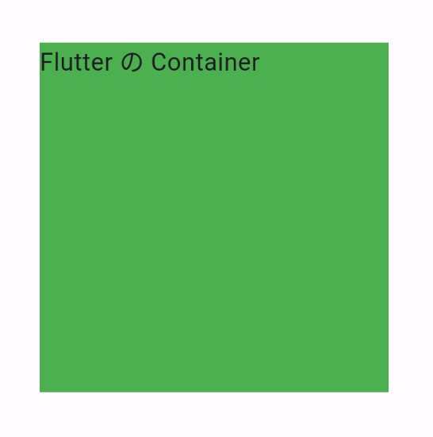
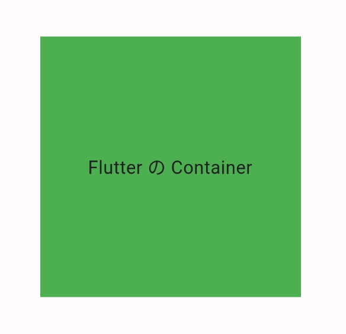

Title: Flutter の Container

[公式ドキュメント：Container class](https://api.flutter.dev/flutter/widgets/Container-class.html)

`Container` は、色、配置、サイズなどの指定をすることができるウィジェットです。


```
Container(
      width: 200,
      height: 200,
      color: Colors.green,
    )
```

`Container` は、子ウィジェットを 1 つだけ配置できます。子ウィジェットは、`child` プロパティで指定します。



```
Container(
      width: 100,
      height: 100,
      color: Colors.green,
      child: const Text('Flutter の Container'),
    )
```

子ウィジェットを中央に配置するには、`alignment` プロパティで `Alignment.center` を指定します。



```
Container(
      alignment: Alignment.center,
      width: 200,
      height: 200,
      color: Colors.green,
      child: const Text('Flutter の Container'),
    )
```
