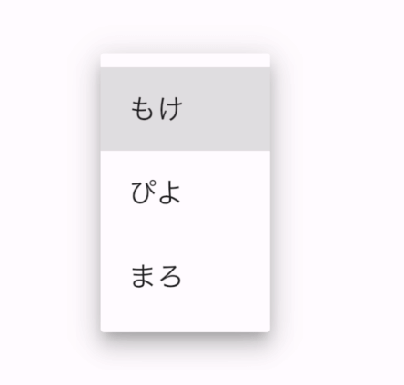

Title: Flutterでドロップダウンメニューを表示する

Priority: 10

Flutterでドロップダウンメニュー(Androidだと `Spinner`  Webだと `<select>` ) を表示するには `DropdownButton` を使います。
似たようなクラスに `DropdownMenu` がありますが、こちらは `TextField`　の機能もセットになっています。

## 選択肢を作る

選択肢は `DropdownMenuItem` で作ります。

```
const _items = [
  DropdownMenuItem(
    value: 'moke',
    child: Text('もけ'),
  ),
  DropdownMenuItem(
    value: 'piyo',
    child: Text('ぴよ'),
  ),
  DropdownMenuItem(
    value: 'mallo',
    child: Text('まろ'),
  ),
];
```

## 表示する

表示には `DropdownButton` を使います。今なにを選択しているかは状態としてもたせ、 `onChanged()` で更新します。

```
class _MyHomePageState extends State<MyHomePage> {
  String _value = _items[0].value!;

  @override
  Widget build(BuildContext context) {
    return Scaffold(
      body: Center(
        child: DropdownButton(
          value: _value,
          items: _items,
          onChanged: (value) {
            setState(() {
              _value = value!;
            });
          },
        ),
      ),
    );
  }
}
```

要素をタップすると選択肢が表示されます。



