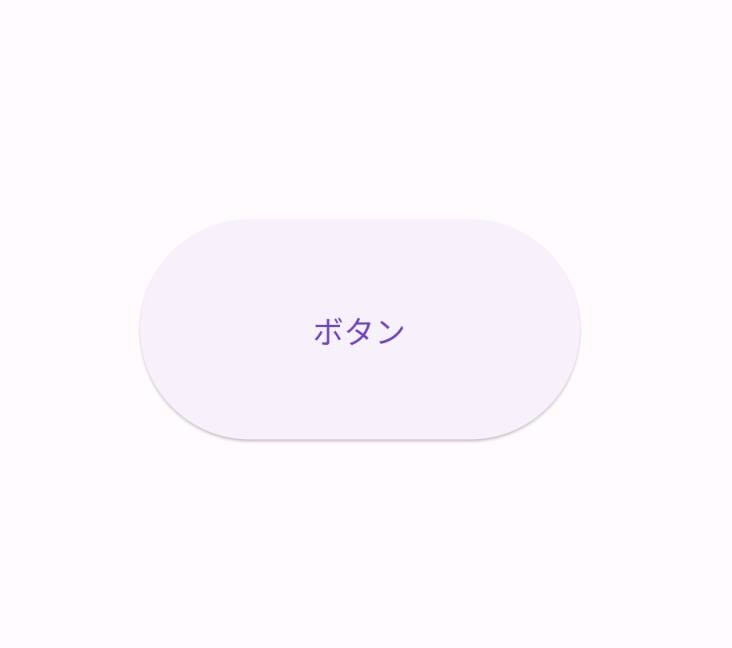

Title: Flutter の SizedBox

SizedBox class は、指定したサイズのボックスを作成するためのウィジェットで、子の高さや幅を設定します。余白の作成としても使えます。

[公式ドキュメント：SizedBox class](https://api.flutter.dev/flutter/widgets/SizedBox-class.html)



```
SizedBox(
  width: 200,
  height: 100,
  child: ElevatedButton(
    child: const Text('ボタン'),
    onPressed: () {},
  ),
);
```
