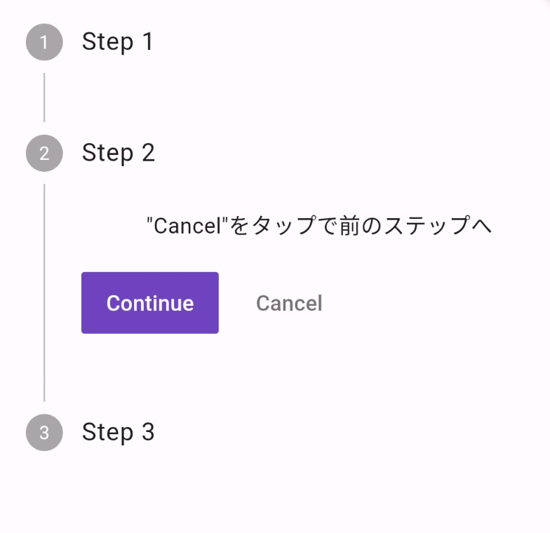

Title: Flutter の Stepper

[公式ドキュメント：Stepper class](https://api.flutter.dev/flutter/material/Stepper-class.html)

Stepper class は、一連のステップの進行状況を表示するためのウィジェットです。
フォームの各ステップを表すために使用したり、ユーザーがタスクを完了するために必要な手順を示すために使用したりできます。





```
int _currentStep = 0;

final List<Step> _steps = const [
    Step(
    title: Text('Step 1'),
    content: Text('"Continue"をタップで次のステップへ'),
    ),
    Step(
    title: Text('Step 2'),
    content: Text('"Cancel"をタップで前のステップへ'),
    ),
    Step(
    title: Text('Step 3'),
    content: Text('ステップ名をタップすることで、そのステップへ'),
    ),
];

@override
Widget build(BuildContext context) {
    return Scaffold(
    body: Stepper(
        currentStep: _currentStep,
        onStepContinue: () {
        setState(() {
            if (_currentStep < _steps.length - 1) {
            _currentStep++;
            }
        });
        },
        onStepCancel: () {
        setState(() {
            if (_currentStep > 0) {
            _currentStep--;
            }
        });
        },
        onStepTapped: (int index) {
        setState(() {
            _currentStep = index;
        });
        },
        steps: _steps,
    ),
    );
}
```
