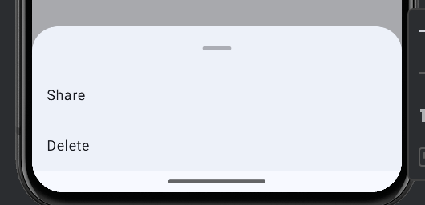

Title: Jetpack ComposeでModalBottomSheetを表示する

Priority: 10

Jetpack ComposeでModalBottomSheetを表示するには、 `ModalBottomSheet` を使います。基本的な使い方はダイアログと同じです。

```
var visible by remember { mutableStateOf(false) }

if (visible) {
  ModalBottomSheet(onDismissRequest = { visible = false }) {
    LazyColumn {
      item {
        ListItem(headlineContent = { Text("Share") })
      }
      item {
        ListItem(headlineContent = { Text("Delete") })
      }
    }
  }
}
```

 `onDismissRequest` は背景部分をタップしたり、端末のバックボタンが押されたりした時に呼ばれます。

表示は次のようになります。


