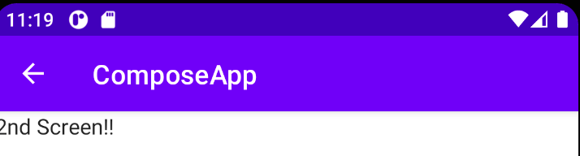

Title: TopAppBarの戻るボタンに対応する

※もっとわかりやすい方法があったらどなたか教えてください。。。

Navigation Composeで画面遷移をした際、画面の情報はフラグメントの時と同様にバックスタックに積まれていきます。
そして端末のバックボタンを押すと1つ前の画面に戻ることができます（設定で2つ前に戻るみたいなこともできます）

しかし、TopAppBarの左上のアイコン表示は自動でやってくれません。今回はこの部分に対応していきます。



## バックスタックを状態として扱う

まず、バックスタックの状態にあわせて戻るアイコンの表示/非表示を切り替えたいので、バックスタックを状態として取得します。
これにより、端末のバックボタンなどで戻った際、該当のComposableが再Composeされ、表示が変化します。

バックスタックを状態として取得するには、 `currentBackStackEntryAsState()` を呼びます。
拡張関数として定義されているので別途importが必要です。

```kotlin
@Composable
fun MyApp() {
    ComposeAppTheme {
        val navController = rememberNavController()
        // 状態として取得する
        val navBackStackEntry by navController.currentBackStackEntryAsState()
        ...
    }
}
```

## Navigation Iconを設定する

状態として取得した `navBackStackEntry` をもとに、 `TopAppBar` の `Navigation Icon` を設定します。 

```kotlin
@Composable
fun MyTopAppBar(
    navController: NavController,
    navBackStackEntry: NavBackStackEntry?
) {
    val navigationIcon: (@Composable () -> Unit)? =
            if (navBackStackEntry?.destination?.route != "main") {
                {
                    IconButton(onClick = {
                        navController.popBackStack()
                    }) {
                        Icon(
                            imageVector = Icons.Outlined.ArrowBack,
                            contentDescription = "Back"
                        )
                    }
                }
            } else {
                null
            }
    TopAppBar(
        title = {
            Text(text = stringResource(id = R.string.app_name))
        },
        navigationIcon = navigationIcon,
    )
}
```

戻るボタンが必要ない場合、 `TopAppBar` の `navigationIcon` パラメータに `null` を指定する必要があるため、
ややこしいコードになっています。今、どの画面にいるかは `navBackStackEntry.destination.route` に入っています。

