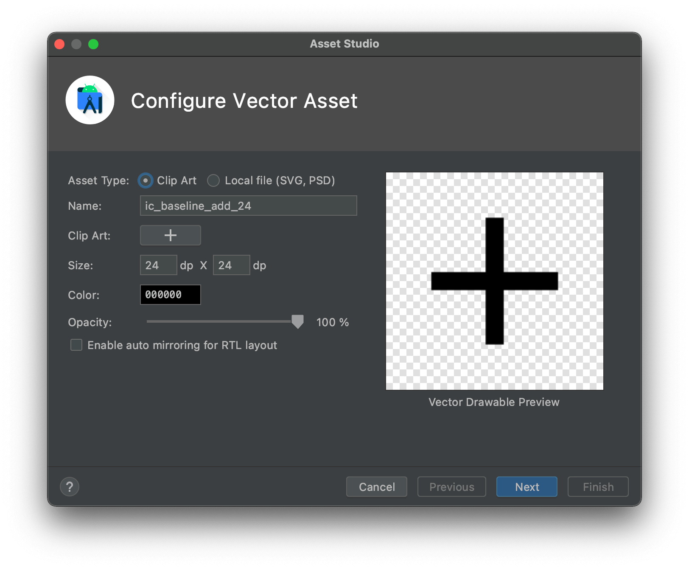
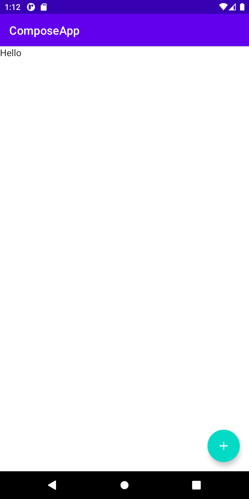

Title: Scaffold ComposableにFloatingActionButton(FAB)を追加する

 `Scaffold` にFloatingActionButton(FAB)を追加するには、 `floatingActionButton` パラメータで `FloatingActionButton` を指定します。
 
 ```kotlin
 Scaffold(
    topBar = { MyTopAppBar() },
    // このパラメータを追加する
    floatingActionButton = {
        FloatingActionButton(onClick = {
            println("Clicked!")
        }) {
            Image(
                painter = painterResource(id = R.drawable.ic_baseline_add_24),
                contentDescription = "Add"
            )
        }
    }
) {
    MainScreen()
}
```

FABの中に表示するアイコンは `Vector Assets` で追加するとよいでしょう。



実行すると次のように右下にFABが表示されます。


