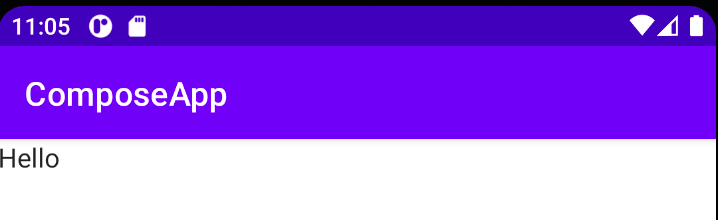

Title: Jetpack ComposeのScaffoldにトップバーを追加する

Jetpack Composeの `Scaffolod` にトップバーを追加するには、 `topBar` パラメータを追加します。
トップバーとはアクションバー(ActionBar)やツールバー(Toolbar)などと呼んでいた部分のことです。
マテリアルデザインでは [App bars](https://material.io/components/app-bars-top) と呼ぶようです。

```kotlin
@Composable
fun MyApp() {
    ComposeAppTheme {
        Scaffold(
            // topBarを指定する
            // ネストが深くなったので別Composableにしました
            topBar = { MyTopAppBar() }
        ) {
            MainScreen()
        }
    }
}

@Composable
fun MyTopAppBar() {
    TopAppBar(
        title = {
            Text(text = stringResource(id = R.string.app_name))
        },
    )
}
```

 `TopBar` のカスタマイズは別ページで紹介します。
 
実行してみると次のようにトップバーが表示されます。


