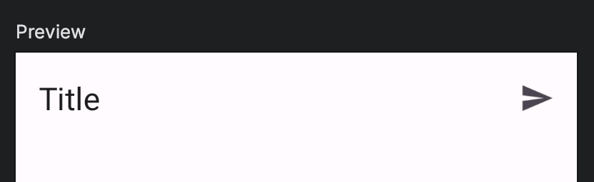

Title: TopAppBarに右上アクションを追加する

Priority: 50

Jetpack ComposeのTopAppBarの右上にアクションを追加するには、 `actions` パラメータで `IconButton` を使います。

```
Scaffold(
  topBar = {
    TopAppBar(
      title = { Text("Title") },
      actions = {
        IconButton(onClick = { /*TODO*/ }) {
          Icon(
            imageVector = Icons.Default.Send,
            contentDescription = "Send",
          )
        }
      }
    )
  }
) { paddingValues -> 
}
```

右上に送信アイコンが表示されました。


