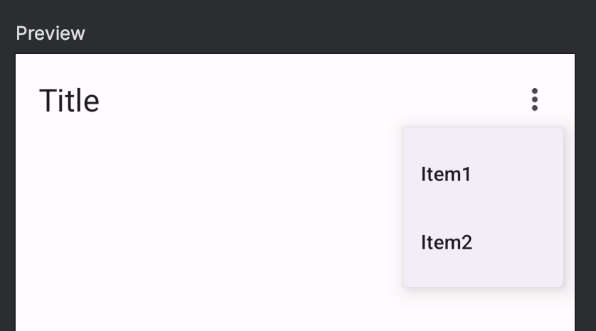

Title: TopAppBarで右上オーバーフローメニューを追加する

Priority: 60

Jetpack ComposeのTopAppBarの右上にオーバーフローメニューを追加するには `DropdownMenu` を使います。

まず、メニューの開閉状態を追加します。

```
var expanded by remember { mutableStateOf(false) }
```

そして `TopAppBar` の　`actions` の中で、ボタンと `DropdownMenu` をセットで配置します。

```
TopAppBar(
  title = { Text("Title") },
  actions = {
    IconButton(onClick = { expanded = !expanded }) {
      Icon(
        imageVector = Icons.Default.MoreVert,
        contentDescription = "More",
      )
      DropdownMenu(expanded = expanded, onDismissRequest = { expanded = false }) {
        DropdownMenuItem(text = { Text("Item1") }, onClick = {
          expanded = false
        })
        DropdownMenuItem(text = { Text("Item2") }, onClick = {
          expanded = false
        })
      }
    }
  }
)
```

オーバーフローメニューが表示された状態は次のようになります。


