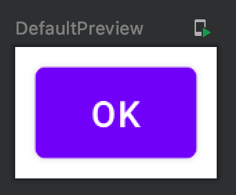

Title: Jetpack Composeでボタンを表示させる

Jetpack Composeでボタンを表示させるには、 `Button` Composable関数を使います。引数にはタップ時に実行してほしい関数と、 `Row` のようにボタンの中に表示させたいComposableを指定します。

```kotlin
@Composable
fun Greeting() {
    Button(onClick = {
        println("clicked!")
    }, modifier = Modifier.padding(8.dp)) { // 中に表示させたいもの
        Text(stringResource(id = android.R.string.ok))
    }
}
```

プレビューは次のようになります。ボタンと認識しやすいよう、パディングをいれています。



