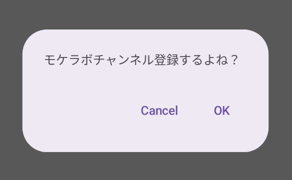

Title: Jetpack Composeでテキストボタンを表示する

Priority: 20

Jetpack Composeでテキストボタンを表示するには `TextButton` コンポーザブルを使います。表示するテキストは `Text` コンポーザブルを使います。

ダイアログのOK/キャンセルボタンで使うことが多いでしょう。

```
AlertDialog(
  text = { Text("モケラボチャンネル登録するよね？") },
  onDismissRequest = { /*TODO*/ },
  confirmButton = {
    TextButton(onClick = { /*TODO*/ }) {
      Text(stringResource(android.R.string.ok))
    }
  },
  dismissButton = {
    TextButton(onClick = { /*TODO*/ }) {
      Text(stringResource(android.R.string.cancel))
    }
  }
)
```

表示は次のようになります。


