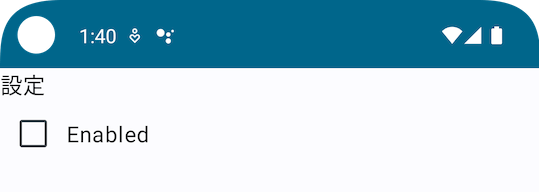

Title: Jetpack Composeでチェックボックスを表示する

Priority: 10

Jetpack Composeでチェックボックスを表示するには `Checkbox` コンポーザブル関数を使います。ラベルの表示は別途 `Text` 等で表示する必要があるので、
次のように `Row` と組み合わせて使いましょう。

```
@Composable
fun MainScreen() {
  // チェック状態
  var enabled by remember { mutableStateOf(false) }
  Column {
    Text("設定")
        
    Row(
      verticalAlignment = Alignment.CenterVertically,
    ) {
      Checkbox(checked = enabled, onCheckedChange = { enabled = it })
      Text("Enabled")
    }
  }
}
```

実行すると、次のようにチェックボックスが表示されます。


