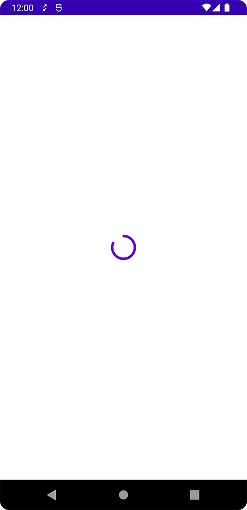

Title: Jetpack Composeで読み込み中のぐるぐるを表示する
Priority: 10

Jetpack Composeで読み込み中を表すぐるぐるを表示するには、 `CircularProgressIndicator()` を使います。

```kotlin
@Composable
fun Greeting() {
    Box(contentAlignment = Alignment.Center) {
        CircularProgressIndicator()
    }
}
```

実行すると次のようになります。


