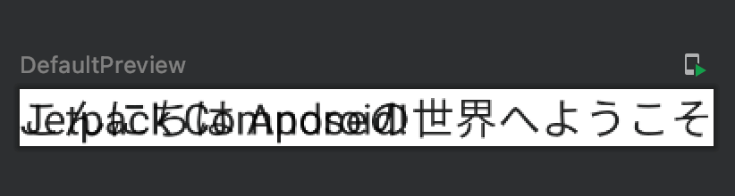
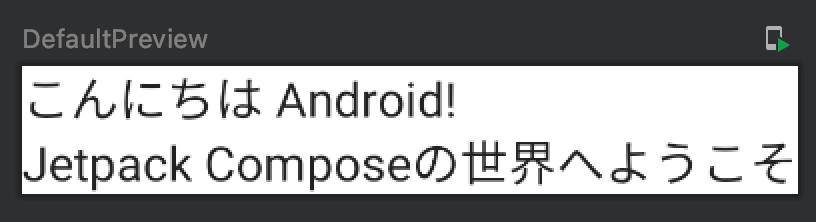

Title: Jetpack ComposableでComposableを縦に並べる

Jetpack ComposeはComposable関数の中で表示したいComposable関数を呼ぶことで画面を作ります。縦に2つ並べたい場合、HTMLのノリで次のように呼んでみます。

```kotlin
@Composable
fun Greeting(name: String) {
    Text(text = "こんにちは $name!")
    Text(text = "Jetpack Composeの世界へようこそ")
}
```

これをプレビューで確認すると次のように表示されてしまいます。



Jetpack Composableで縦に並べるには、次のように `Column` を使います。

```kotlin
@Composable
fun Greeting(name: String) {
    Column {
        Text(text = "こんにちは $name!")
        Text(text = "Jetpack Composeの世界へようこそ")
    }
}
```

プレビューは次のようになります。



