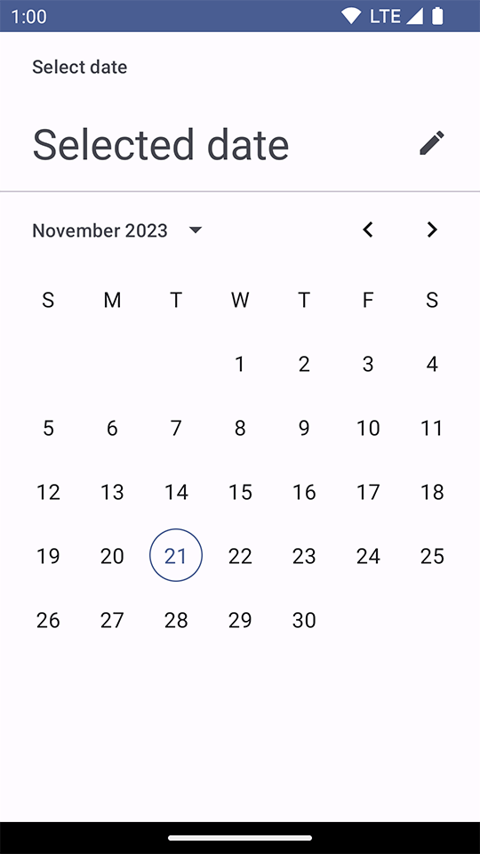

Title: Jetpack ComposeでDatePickerを表示する

Priority: 10

Jetpack Composeで日付選択させたい場合、 `DatePicker` を使います。ダイアログで表示したい場合は `DatePickerDialog` が用意されています。

```
@Composable
fun DatePickerScreen() {
    val state = rememberDatePickerState()
    Scaffold { innerPadding ->
        DatePicker(
            state = state,
            modifier = Modifier.padding(innerPadding),
        )
    }
}
```

何日が選択されたかは　`state.selectedDateMillis` で取得できます。未選択の場合は `null` になっています。

表示は次のようになります。



