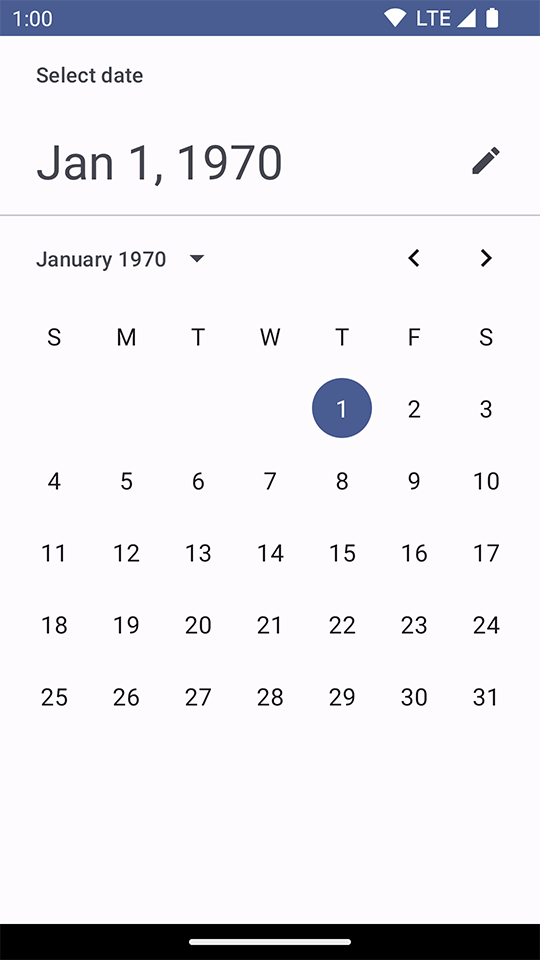

Title: Jetpack ComposeのDatePickerで初期値を設定する

Priority: 20

Jetpack Composeの `DatePicker` で初期値を設定したい場合は `rememberDatePickerState()` の `initialSelectedDateMillis` パラメータで指定します。
単位はUnix Timeのミリ秒です。

 `LaunchedEffect` で `state.setSelection()` を使って指定する方法もありますが、この方法だとカレンダー部分は現在の月になる点に注意しましょう。

```
@Composable
fun DatePickerScreen() {
    val state = rememberDatePickerState(
        initialSelectedDateMillis = 0,
    )
    Scaffold { innerPadding ->
        DatePicker(
            state = state,
            modifier = Modifier.padding(innerPadding),
        )
    }
}
```

実行すると次のように1970年1月1日(Unit Time = 0)が選択された状態になります。


