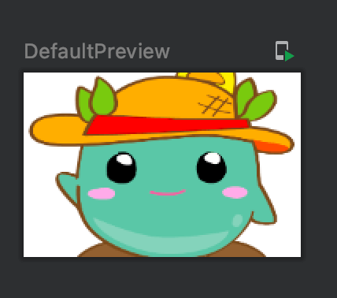

Title: Image Composableで画像の中央で切り取って表示する

`ImageView` では、 `android:scaleType="centerCrop"` を指定することでビューのサイズより画像が大きい場合、はみ出るよう上下左右どちらかをビューに合わせ、画像の中央で切り取って表示ができます。

Image Composableで同じことを実現するには、次のように `contentScale` と `alignment` パラメータを指定します。

```kotlin
@Composable
fun Greeting(name: String) {
    Image(painter = painterResource(id = R.drawable.moke),
        contentDescription = "Mokera",
        modifier = Modifier.width(96.dp).height(64.dp),
        contentScale = ContentScale.Crop,
        alignment = Alignment.Center
    )
}
```

プレビューは次のようになります。幅のほうが広いので幅いっぱいに拡大し、中央で切り取られています。


