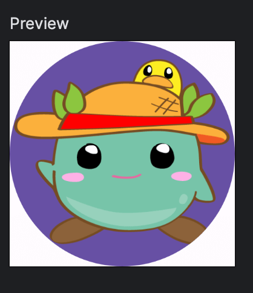

Title: Jetpack Composeで画像を丸く切り抜く

Priority: 30

Jetpack Composeの `Image` で画像を丸く切り抜くには、 `Modifier.crip()` を使います。

```
Image(
  painter = painterResource(R.drawable.moke),
  contentDescription = "moke",
  modifier = Modifier
    .clip(CircleShape)
    .background(color = MaterialTheme.colorScheme.primary)
)
```

 `clip()` には `CircleShape` を指定します。 

切り抜いたあと、背景色を設定しておかないと本当に切り抜けていたか判別に困ったので `background()` で色をつけています。

プレビューは次のようになります。



