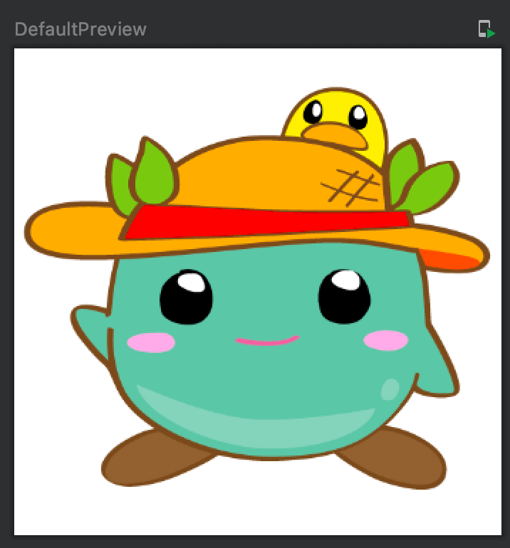

Title: Jetpack Composeで画像リソースを表示する

Jetpack Composeで画像リソースを表示するには、 `Image` Composable関数を使います。 `painter` パラメータで表示内容を指定します。

画像リソースを指定するには、 `painterResource` を使います。引数にはDrawableを指定します。また、アクセシビリティのための文字列を `contentDescription` で指定します。

```kotlin
@Composable
fun Greeting(name: String) {
    Image(painter = painterResource(id = R.drawable.moke),
        contentDescription = "Mokera")
}
```

プレビューは次のようになります。


