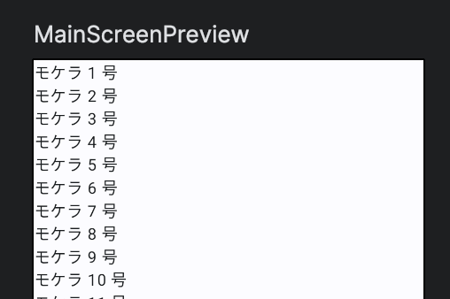

Title: Jetpack Composeで縦リスト表示をする

Priority: 10

Jetpack Composeで縦方向のリスト表示をするには、 `LazyColumn` を使います。
View SystemではRecyclerViewを使っていました。

```
val names = (1..100).map { "モケラ $it 号" }

@Composable
fun MainScreen() {
  LazyColumn {
    items(names) { name ->
      Text(name)
    }
  }
}
```

コンテンツ部分で　`items` を使って、1行分のレイアウトをどうするかを指定します。アダプタークラスを作ったりする必要はありません。

プレビューは次のようになります。


