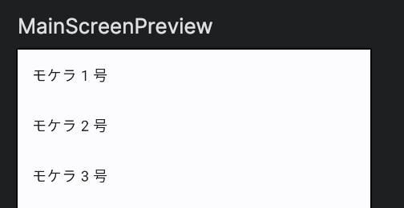
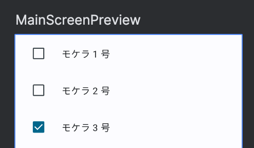
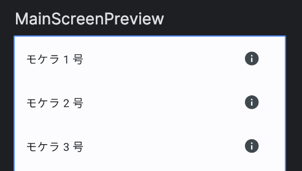

Title: ListItemを使って1行分のレイアウトを作る

Priority: 20

リストの1行分のレイアウトですが、マテリアルデザインの仕様にあっているものでよい場合は `ListItem` を使うと便利です。

## テキストのみ

View Systemでは `android.R.layout.simple_list_item_1` を使っていたケースでしょうか。

```
import androidx.compose.material3.ListItem

val names = (1..100).map { "モケラ $it 号" }

@Composable
fun MainScreen() {
  LazyColumn {
    items(names) { name ->
      ListItem(
        headlineContent = {
          Text(name)
        },
      )
    }
  }
}
```

表示は次のようになります。



## テキスト2行

 `supportingContent` を使います。

```
val names = (1..100).map { "モケラ $it 号" }

@Composable
fun MainScreen() {
  LazyColumn {
    itemsIndexed(names) { index, name ->
      ListItem(
        headlineContent = {
          Text(name)
        },
        supportingContent = {
          Text("$index 番目")
        }
      )
    }
  }
}
```

表示は次のようになります。


## 先頭にチェックボックス

まとめて削除の機能を実装したりする際に使うとよさそうです。

```
data class Item(
  val id: Int,
  val name: String,
)

val mokeras = (1..100).map {
  Item(
    id = it,
    name = "モケラ $it 号",
  )
}

@Composable
fun MainScreen() {
  var checkedIdSet by remember {
    mutableStateOf(emptySet<Int>())
  }
  LazyColumn {
    items(mokeras) { mokera ->
      ListItem(
        headlineContent = {
          Text(mokera.name)
        },
        leadingContent = {
          Checkbox(
            checked = checkedIdSet.contains(mokera.id),
            onCheckedChange = { checked ->
              checkedIdSet = if (checked) {
                checkedIdSet + mokera.id
              } else {
                checkedIdSet - mokera.id
              }
            }
          )
        }
      )
    }
  }
}
```

表示は次のようになります。



## 末尾にアイコン

 `trailingContent` で指定します。

```
val names = (1..100).map { "モケラ $it 号" }

@Composable
fun MainScreen() {
  LazyColumn {
    items(names) { name ->
      ListItem(
        headlineContent = {
          Text(name)
        },
        trailingContent = {
          IconButton(onClick = { /*TODO*/ }) {
             Icon(
               imageVector = Icons.Default.Info,
                 contentDescription = ""
               )
            }
        }
      )
    }
  }
}
```

表示は次のようになります。



