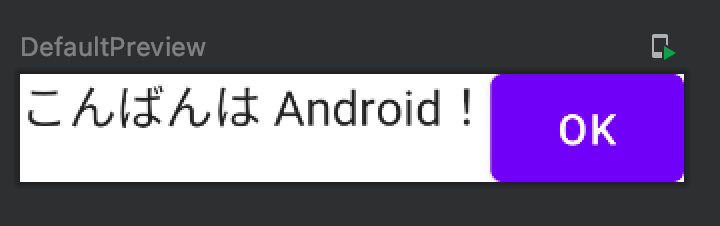

Title: Jetpack ComposeでComposableを横に並べる

Jetpack ComposeでComposableを横に並べるには `Row` を使います。

```kotlin
@Composable
fun Greeting2(name: String) {
    Row {
        Text(text = "こんばんは $name！")
        Button(onClick = {
            println("clicked!")
        }) {
            Text(text = "OK")
        }
    }
}
```

プレビューは次のようになります。


