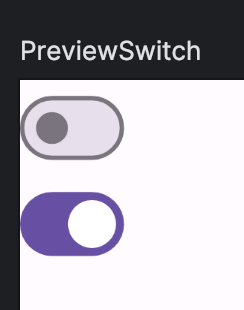

Title: Jetpack Composeでスイッチを表示する

Priority: 10

Jetpack ComposeでON/OFFスイッチを表示するには、 `Switch` コンポーザブルを使います。

基本的な使い方は `Checkbox` と同じです。

```
var checked by remember { mutableStateOf(false) }

Switch(
    checked = checked,
    onCheckedChange = { checked = it },
)
```

プレビューは次のようになります。


