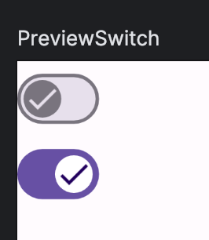
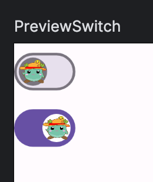

Title: アイコン付きSwitchを表示する

Priority: 20

Jetpack Composeでスイッチにアイコンを表示させるには、 `thumbContent` パラメータでコンポーザブルを指定します。

```
var checked by remember { mutableStateOf(initial) }

Switch(
    checked = checked,
    onCheckedChange = { checked = it },
    thumbContent = {
        Icon(imageVector = Icons.Default.Done, contentDescription = "Done")
    }
)
```

プレビューは次のようになります。



実用的かどうかはわかりませんが、 `Image` を使うと画像を表示させることもできます。

```
var checked by remember { mutableStateOf(initial) }

Switch(
    checked = checked,
    onCheckedChange = { checked = it },
    thumbContent = {
        // 画像を指定する
        Image(painter = painterResource(id = R.drawable.moke), contentDescription = "Moke")
    }
)
```

プレビューは次のようになります。




