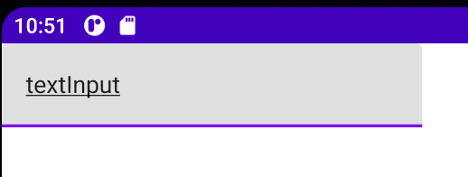

Title: Jetpack Composeでテキスト入力欄を表示する

Jetpack Composeでテキスト入力欄を表示するには `TextField` Composable関数を使います。
引数 `value` には現在表示中のテキストを指定し、 `onValueChange` で入力中の内容が更新されたとき、現在表示中テキストを更新します。

```kotlin
@Composable
fun Greeting() {
    var text by remember { mutableStateOf("") }

    TextField(value = text,
        onValueChange = { newValue -> text = newValue }
    )
}
```

再Compose時に入力中の内容が消えてしまうと困るので、 `remember` を使います。 `getValue` と `setValue` のインポートが必要なので追加しておきましょう。

```kotlin
import androidx.compose.runtime.getValue
import androidx.compose.runtime.setValue
import androidx.compose.runtime.mutableStateOf
import androidx.compose.runtime.remember
// or
import androidx.compose.runtime.*
```

プレビューは次のようになります。今回はプレビュー部分をエミュレーターで実行しています。



