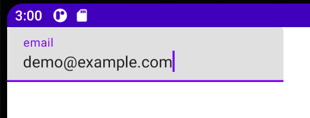

Title: TextFieldでヒント文字列を表示する

Jetpack Composeの　`TextField` でヒントを表示するには、 `label` パラメータにText Composableを指定します。

```kotlin
@Composable
fun Greeting4() {
    var text by remember { mutableStateOf("") }

    TextField(value = text,
        onValueChange = { newValue -> text = newValue },
        label = {
            Text("email")
        }
    )
}
```

表示は次のようになります。


