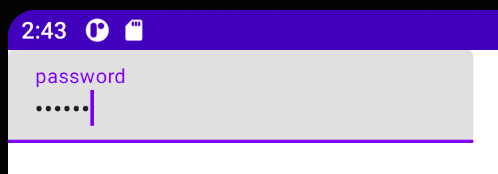

Title: TextFieldでパスワード入力欄を表示する

Jetpack Composeでパスワード入力欄を表示するには、 `TextField` の `visualTransformation` と `keyboardOptions` パラメータに値を指定します。
Viewシステムの `EditText` では `android:inputType="textPasssord"` を指定して実現していました。

```kotlin
@Composable
fun Greeting() {
    var text by remember { mutableStateOf("") }

    TextField(
        value = text,
        onValueChange = { newValue -> text = newValue },
        label = {
            Text("password")
        },
        // この2つを追加する
        visualTransformation = PasswordVisualTransformation(),
        keyboardOptions = KeyboardOptions(
            keyboardType = KeyboardType.Password,
            imeAction = ImeAction.Done,
        ),
    )
}
```

`visualTransformation` には `PasswordVisualTransformation()` を指定します。この指定を忘れると入力してもらったパスワードがそのまま見えてしまいます。

`keyboardOptions` には `KeyboardOptions` を指定します。 `keyboardType` に `KeyboardType.Password` を指定し、 `imeAction` も適切なものを指定します。
`imeAction` の指定を省略すると、パスワードの文字として改行コードが入力可能になってしまいます。

プレビューは次のようになります。



