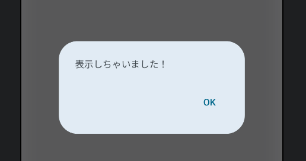

Title: Jetpack ComposeでAlertDialogを表示する

Priority: 10

Jetpack ComposeでAlertDialogを表示するには、 `AlertDialog()` を使います。 DialogFragmentを作る必要はありません。

```
@Composable
fun MainScreen() {
  var visible by remember { mutableStateOf(true) }
  if (visible) {
    AlertDialog(
      onDismissRequest = {
        visible = false
      },
      text = {
        Text("表示しちゃいました！")
      },
      confirmButton = {
        TextButton(onClick = { visible = false }) {
          Text(stringResource(android.R.string.ok))
        }
      },
    )
  }
}
```

 `onDismissRequest` はダイアログの外側をタップしたときに呼ばれます。外側タップでダイアログを閉じたいときは上記のように `visible = false` で表示されないようにします。

表示は次のようになります。


