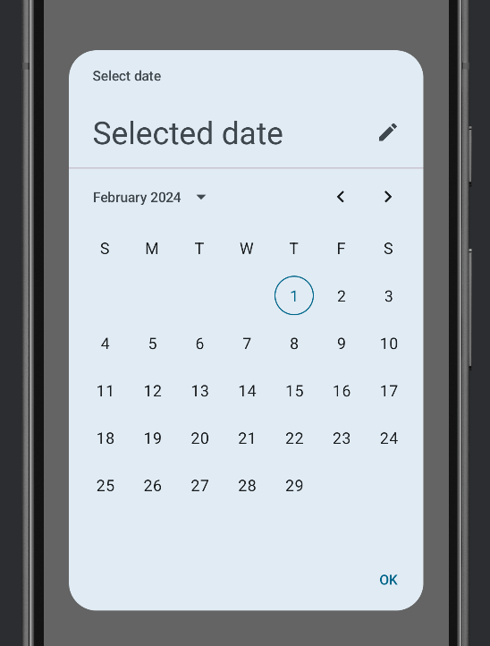

Title: Jetpack Composeで日付選択ダイアログを表示する

Priority: 10

Jetpack Composeで日付選択ダイアログを表示するには、 `DatePickerDialog` と `DatePicker` を組み合わせて作ります。 `DatePickerDialog`だけでは何も表示されないので注意しましょう。

```
@OptIn(ExperimentalMaterial3Api::class)
@Composable
fun MainScreen() {
  val state = rememberDatePickerState()
  var visible by remember { mutableStateOf(true) }
  if (visible) {
    DatePickerDialog(
      onDismissRequest = {
        visible = false
      },
      confirmButton = {
        TextButton(onClick = { visible = false }) {
          Text(stringResource(android.R.string.ok))
        }
      },
    ) {
        // カレンダー部分はDatePicker()を使う
        DatePicker(state)
    }
  }
}
```

表示は次のようになります




