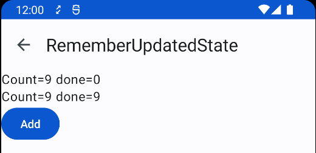

Title: rememberUpdatedStateの使い方

 `LaunchedEffect` や `DisposableEffect` で時間のかかる処理をした後、Composableの引数を使った処理をやりたいときがあります。
 
```
 @Composable
internal fun MyComposable(
    done: () -> Unit,
) {

    LaunchedEffect(Unit) {
        // 3秒待ってから
        delay(3000)
        // 引数で渡されるdoneを呼ぶ！
        done()
    }

    Text("...")
}
```

コールバックの `done()` が変化するたびにコルーチンを再起動するのは望ましくないので、 `LaunchedEffect()` の引数には `Unit` を指定しています。

しかし再Composeが走ると `done` が変化していることもあります。こんな時に使えるのが `rememberUpdatedState` です。

```
 @Composable
internal fun MyComposable(
    done: () -> Unit,
) {

    val currentDone by rememberUpdatedState(done)

    LaunchedEffect(Unit) {
        // 3秒待ってから
        delay(3000)
        // rememberUpdatedStateの中身を呼ぶ！
        currentDone()
    }

    Text("...")
}
```

これで、時間のかかる処理をした後、再Composeによって最新のものに差し替えられた `done()` が呼ばれるようになります。

## 具体例で確認する

[公式ドキュメント](https://developer.android.com/jetpack/compose/side-effects?hl=ja#rememberupdatedstate)を見ても動きをイメージしづらいので、
具体例で確認してみます。

```
@Composable
fun MainScreen() {
    var counter by remember { mutableStateOf(0) }
    // 結果をいれておく用
    var goodDone by remember { mutableStateOf(-1) }
    var badDone by remember { mutableStateOf(-1) }
    // 今の値をキャプチャー
    val v = counter

    Column(modifier = Modifier.padding(paddingValues)) {
        Bad(
            count = counter,
            doneValue = badDone,
        ) {
            badDone = v
        }

        Good(
            count = counter,
            doneValue = goodDone,
        ) {
            goodDone = v
        }
        
        // counterを増やすボタン
        Button(onClick = {
            ++counter
        }) {
            Text("Add")
        }
    }
}
```

　`Bad` は引数の `done()` をそのまま呼ぶ方法にしてみます。
 
```
@Composable
fun Bad(
    count: Int,
    doneValue: Int,
    done: () -> Unit,
) {

    LaunchedEffect(Unit) {
        delay(3000)
        // そのまま呼ぶ
        done()
    }

    Text("Count=${count} done=${doneValue}")
}
```

 `Good` は `rememberUpdatedState` を使ってみます。

```
@Composable
fun Good(
    count: Int,
    doneValue: Int,
    done: () -> Unit,
) {
    val currentDone by rememberUpdatedState(done)

    LaunchedEffect(Unit) {
        delay(3000)
        // rememberUpdatedStateの中身を呼ぶ！
        currentDone()
    }

    Text("Count=${count} done=${doneValue}")
}
```

実行し、3秒の間にボタンを連打してみます。



 `Bad` のほうは最初にComposeされた時の `done()` を呼んでいるため、 `doneValue` は0になりました。 一方 `Good` のほうは最後にComposeされたときの `done()` が呼ばれ、 `doneValue` は9になりました。
