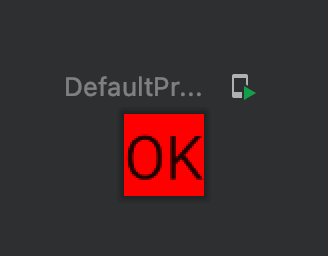

Title: Jetpack Composeで背景色を指定する

Composableの背景色を設定するには、 `modifier` パラメータに `Modifier.background()` を渡します。

```kotlin
@Composable
fun Greeting() {
    Text("OK",
        modifier = Modifier.background(
            color = Color(0xFFFF0000)
        )
    )
}
```

プレビューは次のようになります。


