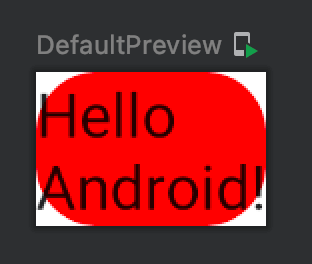
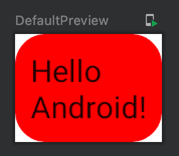

Title: Jetpack Composeで角丸の背景色を指定する

Jetpack Composeで `Modifier.background()` を呼ぶ際、 `shape` パラメータに `RoundedCornerShape()` を指定すると角丸の背景色を指定することができます。

```kotlin
@Composable
fun Greeting() {
    Text("Hello\nAndroid!",
        modifier = Modifier.background(
            color = Color(0xFFFF0000),
            shape = RoundedCornerShape(16.dp),
        )
    )
}
```

プレビューは次のようになります。



色を塗っている内部にテキストを配置したい場合は、後ろに `padding()` をつけましょう。

```kotlin
@Composable
fun Greeting() {
    Text("Hello\nAndroid!",
        modifier = Modifier.background(
            color = Color(0xFFFF0000),
            shape = RoundedCornerShape(16.dp),
        ).padding(all = 8.dp)
    )
}
```

プレビューは次のようになります。


