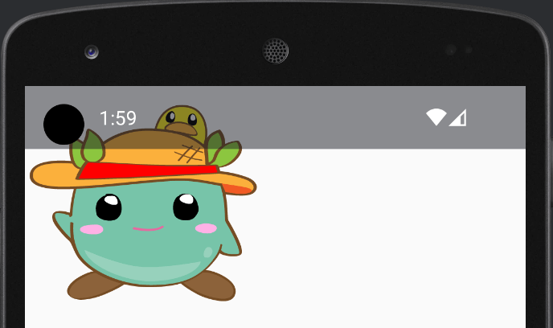
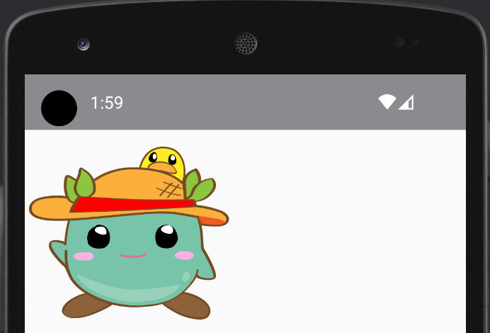

Title: Jetpack Composeでディスプレイカットアウト分の余白をいれる

Priority: 60

 `Modifier` の `displayCutoutPadding()` を使うと、ディスプレイカットアウト（ノッチ等）に応じて余白を追加することができます。

```
@Composable
fun MainApp() {
    Image(
        painter = painterResource(R.drawable.moke),
        contentDescription = "Moke",
        modifier = Modifier.displayCutoutPadding()
    )
}
```

 `modifier` なしの場合、画像がディスプレイカットアウトの領域にも表示されています。



 `modifier` ありの場合、ディスプレイカットアウトの分だけ余白が追加されています。


