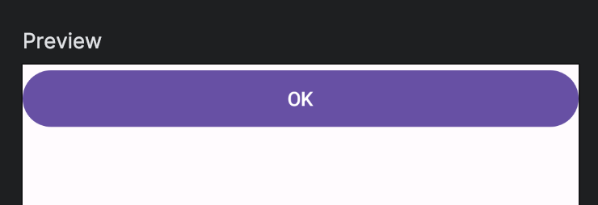

Title: Jetpack Composeで横幅を画面いっぱいにする

Priority: 70

Jetpack Composeでコンポーザブルの横幅を画面いっぱいにするには、 `Modifier.fillMaxWidth()` を使います。

View Systemでは `ViewGroup.LayoutParams.MATCH_PARENT` を使っていました。

```
Button(
    onClick = { /*TODO*/ },
    modifier = Modifier.fillMaxWidth()
) {
    Text("OK")
}
```

プレビューは次のようになります。


