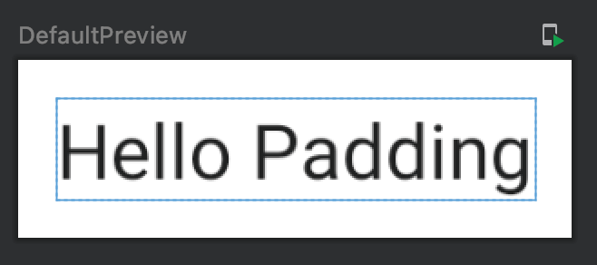
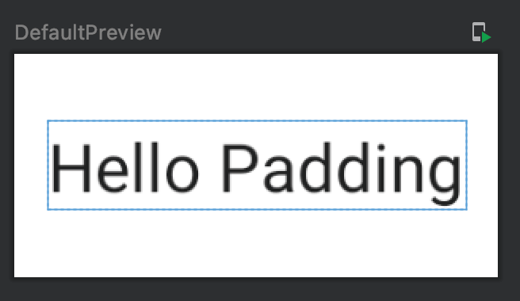
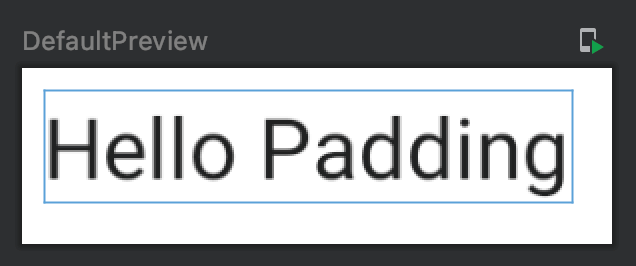

Title: Jetpack Composeで余白(Padding)を指定する

Jetpack Composeで余白を指定するには、 `Modifier.padding()` を使います。WebやViewシステムでは要素間の余白を設定するためにマージン(margin)も使いましたが、
Jetpack Composeではパディング(Padding)のみ使います。

## 上下左右に同じ余白を指定する

 `padding() `のパラメータとして `all` を使うと、上下左右に同じ余白を指定することができます。
 
```kotlin
@Composable
fun Greeting() {
    Text("Hello Padding",
        modifier = Modifier.padding(all = 8.dp))
}
```

プレビューは次のようになります。



## 上下と左右をセットで余白を指定する

 `padding() `のパラメータとして `vertical` を使うと、上下に同じ余白を、 `horizontal` を使うと左右に同じ余白を指定することができます。
デフォルト値として `0.dp` が指定されているので、片方だけ指定するといった指定もできます。 
 
```kotlin
@Composable
fun Greeting() {
    Text("Hello Padding",
        modifier = Modifier.padding(
            vertical = 16.dp,
            horizontal = 8.dp
        )
    )
}
```

プレビューは次のようになります。



## 上下左右それぞれ別の値を指定する

以下のパラメータを使うと指定した位置の余白を指定することができます。

- top : 上
- bottom : 下
- start : 文を書き始める位置。日本語だと左
- end : 文を書き終える位置。日本語だと右
            
```kotlin
@Composable
fun Greeting() {
    Text("Hello Padding",
        modifier = Modifier.padding(
            start = 4.dp,
            end = 8.dp,
            top = 4.dp,
            bottom = 8.dp
        )
    )
}
```

プレビューは次のようになります。



