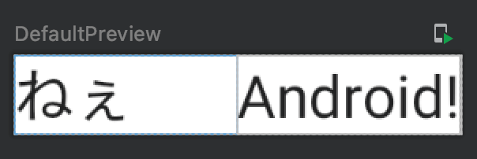

Title: Jetpack Composeで幅を指定する

Composableの幅を指定したサイズにするには、 `modifier` パラメータに `Modifier.width()` を渡します。単位はdp単位です。

```kotlin
@Composable
fun Greeting(name: String) {
    Row {
        Text(text = "ねぇ", modifier = Modifier.width(60.dp))
        Text(text = "$name!")
    }
}
```

プレビューは次のようになります。「ねぇ」の部分がコンテンツ幅ではなく、60dpで余白が生じているのが確認できます。


