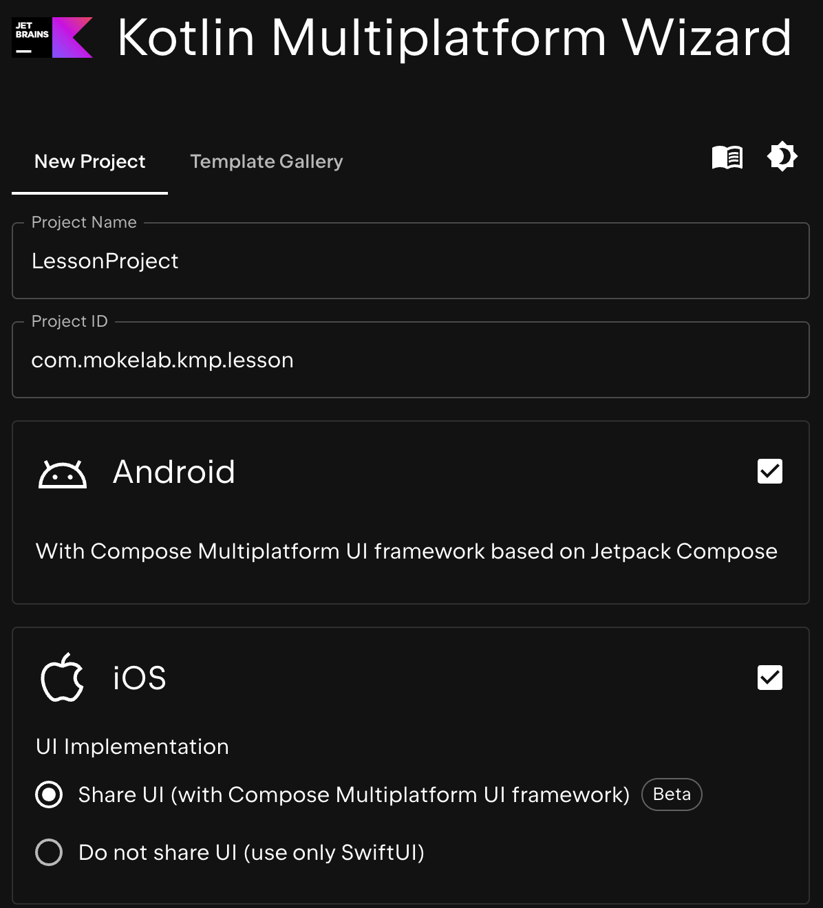

Title: Kotlin Multiplatformのプロジェクトを作る

Priority: 20

Kotlin Multiplatoformのプロジェクトを作るには、 [公式サイトのKotlin Multiplatform Wizard](https://kmp.jetbrains.com/)を使います。

Project Nameにはプロジェクト名を入力し、Product IDはアプリのIDを入力します。Androidであれば `applicationId` にセットされる値となるので、
所持しているドメインを逆順にしたものにアプリ名を加えたものにしておきましょう。

Android向けアプリをビルドしたい場合はAndroidにチェックをいれ、iOS向けアプリをビルドしたい場合はiOSにチェックをいれます。

最後にDOWNLOADボタンを押すと、Kotlin Multiplatformのプロジェクトが入ったzipファイルがダウンロードできます。これを適当なフォルダで展開したらプロジェクトの作成は完了です。
