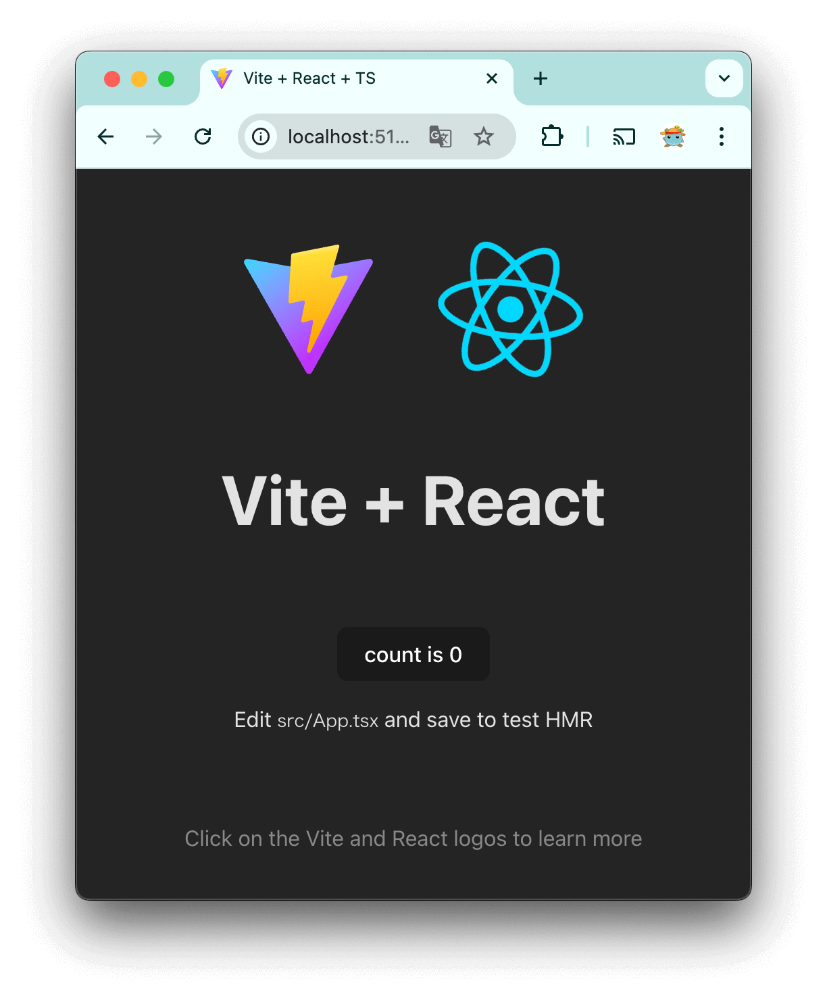

Title: Set up Development environment for React

Priority: 10


To start developing a web app with React, use `npm` and `vite`. Previously `create-react-app` is used.
[vite official site](https://vite.dev/)

## Create a project

Use `npm create vite@latest` 

First, agree to install the required packages.

```
% npm create vite@latest
Need to install the following packages:
create-vite@6.0.1
Ok to proceed? (y)
```

Enter project name.

```
? Project name: › vite-project
```

Choose which framework to use. 

```
? Select a framework: › - Use arrow-keys. Return to submit.
    Vanilla
    Vue
❯   React
    Preact
    Lit
    Svelte
    Solid
    Qwik
    Angular
    Others
```

Next, select the language. Select `TypeScript + SWC`. `SWC` stands for `Speedy Web Compiler` . [Official site](https://swc.rs/)

```
? Select a variant: › - Use arrow-keys. Return to submit.
    TypeScript
❯   TypeScript + SWC
    JavaScript
    JavaScript + SWC
    React Router v7 ↗
```

If Done is displayed, your project is created successfully.

```
Done. Now run:

  cd vite-project
  npm install
  npm run dev
```

Go to the project folder, run `npm install` and run `npm run dev` to start dev server.

```
VITE v6.0.3  ready in 379 ms

  ➜  Local:   http://localhost:5173/
  ➜  Network: use --host to expose
  ➜  press h + enter to show help
```

Open `localhost:5173` on your browser and you will see the following screen.



