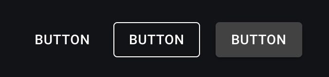
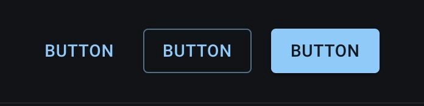
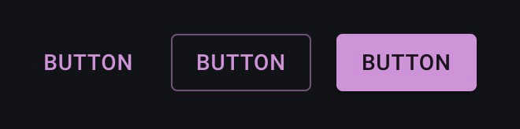
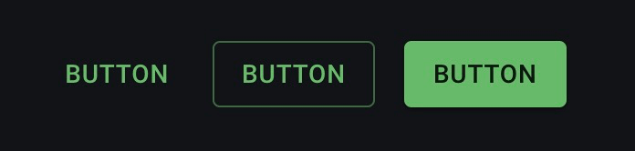
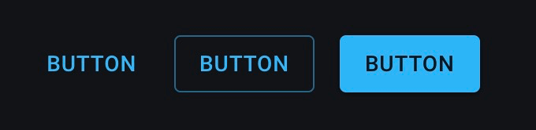
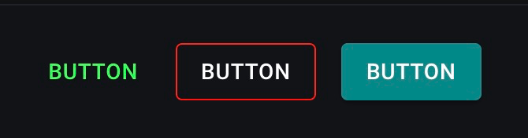

Title: MUI の Button コンポーネントの色を変更する

Priority: 30

Button コンポーネントの色を変更するためには、以下の方法があります。  

1. デフォルトの props を使う
3. sx props を使う

# デフォルトの props を使う

color props を使って色を変更できます。  

## default  

ボタンの色を親要素から継承します.  



```tsx
<Button variant="text" color="inherit">Button</Button>
<Button variant="outlined" color="inherit">Button</Button>
<Button variant="contained" color="inherit">Button</Button>
```

## primary

デフォルトのテーマでは青 (#1976d2) です。  
主要なアクションや強調が必要なボタンに使用されます。ユーザーに目立つ形で表示されるため、クリックを促す効果があります。  




```tsx
<Button variant="text" color="primary">Button</Button>
<Button variant="outlined" color="primary">Button</Button>
<Button variant="contained" color="primary">Button</Button>
```

## secondary

デフォルトのテーマでは紫 (#9c27b0) です。  
主要なアクションではないが、重要なアクションに使用されます。primaryの次に強調したい場合に使います。  



```tsx
<Button variant="text" color="secondary">Button</Button>
<Button variant="outlined" color="secondary">Button</Button>
<Button variant="contained" color="secondary">Button</Button>
```

## success

デフォルトのテーマでは緑 (#4caf50) です。  
成功したアクションやポジティブなフィードバックを示すために使用されます。例えば、フォームの送信成功や操作の完了を示すボタンに使われます。  



```tsx
<Button variant="text" color="success">Button</Button>
<Button variant="outlined" color="success">Button</Button>
<Button variant="contained" color="success">Button</Button>
```

## error

デフォルトのテーマでは赤 (#f44336) です。  
エラーや警告を示すために使用されます。削除や破壊的なアクションに使用することで、ユーザーに注意を促します。  

```tsx
<Button variant="text" color="error">Button</Button>
<Button variant="outlined" color="error">Button</Button>
<Button variant="contained" color="error">Button</Button>
```

## info

デフォルトのテーマでは青 (#2196f3) です。  
情報提供やインフォメーションを示すために使用されます。通知や補足情報の表示に使われます。



```tsx
<Button variant="text" color="info">Button</Button>
<Button variant="outlined" color="info">Button</Button>
<Button variant="contained" color="info">Button</Button>
```

## warning

デフォルトのテーマではオレンジ (#ff9800) です。  
警告や注意が必要なアクションを示すために使用されます。リスクを伴う操作や注意を促す場合に使われます。  


```tsx
<Button variant="text" color="warning">Button</Button>
<Button variant="outlined" color="warning">Button</Button>
<Button variant="contained" color="warning">Button</Button>
```

# sx props を使う

sx props を使って、スタイルを直接設定することもできます。



```tsx
<Button variant="text"  sx={{ color: '#22FF57' }}>Button</Button>
<Button variant="outlined"  sx={{ borderColor: 'red', color: 'white' }}>Button</Button>
<Button variant="contained"  sx={{ backgroundColor: '#088', color: '#FFFFFF' }}>Button</Button>
```

